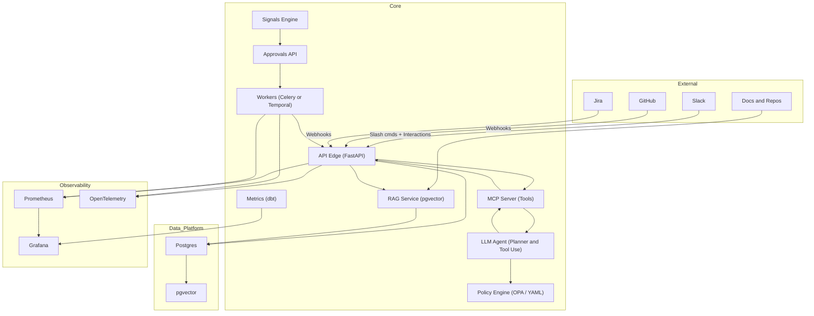
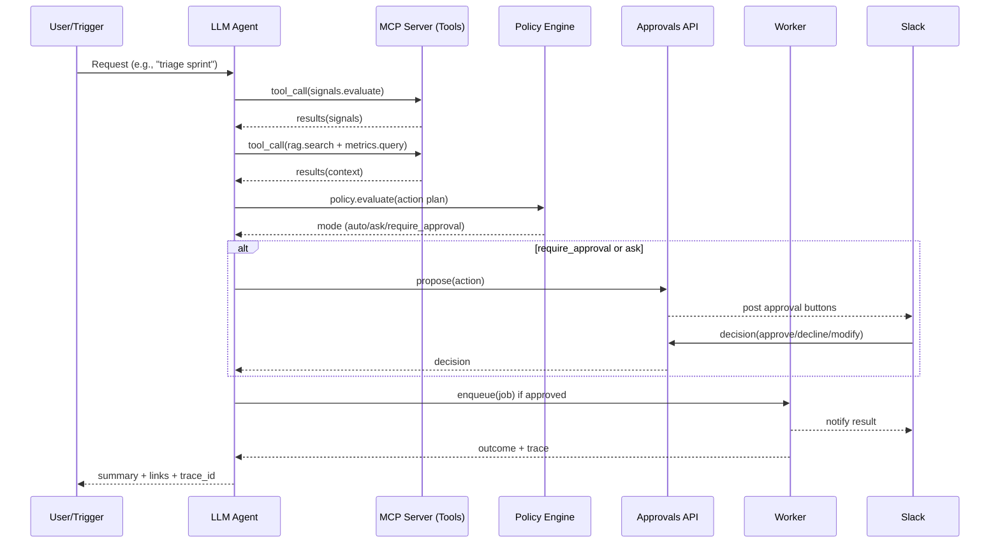
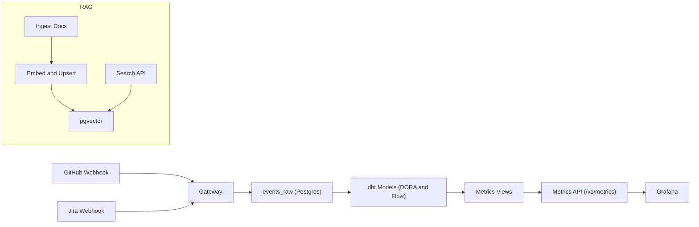

# Engineering Manager Agent (v1) — Release Notes

MCP‑first agentic AI that monitors delivery health, automates standups/triage/retros, and proposes actions with human‑in‑the‑loop approvals. Built on FastAPI, Postgres, dbt, pgvector RAG, and an LLM planning loop that invokes tools via MCP.

## Features

- **MCP-first tool layer**
  - Exposes core capabilities as MCP tools: `signals.evaluate`, `reports.build_standup`, `reports.build_sprint`, `metrics.query`, `rag.search`, `approvals.propose`, `approvals.decide`, `slack.post_text`, `slack.post_blocks`.
  - **Tech**: Model Context Protocol (server + client), FastAPI/uvicorn, JSON schemas (Pydantic) for typed tool I/O.

- **Agentic LLM planning + tool-use**
  - An LLM plans tasks, calls MCP tools iteratively, and synthesizes results into actions (triage summaries, nudges, ticket updates) with policy/approval gates.
  - **Tech**: OpenAI/Anthropic SDKs (provider‑agnostic adapters), structured tool calling, retrieval‑augmented prompting, guardrails (cost/PII/redaction), deterministic modes for critical paths.

- **Human-in-the-loop approvals**
  - Propose/approve/decline/modify decisions via API and Slack interactive buttons; decisions gate execution of risky actions; approved actions enqueue jobs.
  - **Tech**: FastAPI (`/v1/approvals`), Slack interactivity (buttons/modals), SQLAlchemy models, Prometheus metrics (latency, override rate).

- **Slack ChatOps**
  - Slash commands for `signals`, `triage`, `standup`, `sprint`, `ask` (RAG), and approval posting; signature verification and timestamp replay protection.
  - **Tech**: FastAPI routers, HMAC verification with `SLACK_SIGNING_SECRET`, Slack Block Kit; dry‑run mode for safe testing.

- **Webhook ingestion and normalization**
  - GitHub/Jira webhooks with idempotency and signature verification; persists raw events for lineage and reprocessing in `events_raw` with headers/signature/payload.
  - **Tech**: FastAPI, SQLAlchemy, Alembic migrations.

- **Signals engine**
  - YAML rules detect risks (e.g., stale PRs > 48h, PRs without review, WIP limit exceeded). Findings logged to `action_log` and jobs enqueued for execution.
  - **Tech**: YAML rules (`rules.yml`), SQLAlchemy queries, background evaluator thread or Celery/Temporal integration.

- **Policy engine**
  - OPA policies (or YAML fallback) decide mode per action (auto/ask/require_approval) based on risk tiers and context.
  - **Tech**: OPA bundle + REST eval; fallback YAML (`policy.yml`).

- **RAG with pgvector**
  - pgvector‑backed embeddings for engineering docs/runbooks and repo content; hybrid retrieval (BM25 + dense) with source‑linked citations.
  - **Tech**: Postgres + pgvector, sentence‑transformers or OpenAI Embeddings, ingestion workers, cosine‑similarity SQL.

- **Delivery metrics (DORA + flow)**
  - dbt models compute lead time, deployment frequency, change fail rate, MTTR, PR idle time, WIP, and aging WIP; Grafana dashboard; retention job.
  - **Tech**: dbt (Postgres adapter), Grafana JSON dashboards, Prometheus exporters, scheduled runs (CI/k8s CronJob).

- **Workers and orchestration**
  - Background job processing for queued workflow actions; optional Celery or Temporal for long‑running workflows with retries and external signals.
  - **Tech**: Celery/Redis or Temporal Python SDK (configurable), idempotent handlers, retries, DLQ.

- **Observability and tracing**
  - Prometheus metrics for API and background jobs; OpenTelemetry traces spanning propose → approve → execute; structured JSON logs.
  - **Tech**: `starlette-exporter`, OTel SDK + OTLP (Jaeger/Tempo), `structlog`, sampling controls.

- **Security and secrets**
  - Slack/GitHub/Jira signature/JWT verification, approval gating for outward actions, RBAC‑ready admin endpoints.
  - **Tech**: `SLACK_SIGNING_SECRET`, signed webhooks, Vault/SOPS (or env) for secrets, environment profiles.

- **UI and API edge**
  - Minimal UI for search and approvals queue; UI calls the gateway for RAG and actions; SSO‑ready hooks.
  - **Tech**: FastAPI UI service, HTTPX gateway proxy, static SPA assets.

- **Deployment and DevEx**
  - Docker images for gateway/RAG/UI/workers; Helm charts for k8s; Kind/Compose for local.
  - **Tech**: CI for dbt checks, lint/type checks, vulnerability scans; seeded demo data; environment configs.

## Architectural Diagrams

- High-level system architecture

- Agentic loop with HITL approvals

- Data flow and metrics

